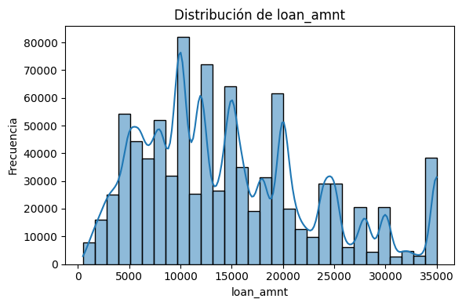
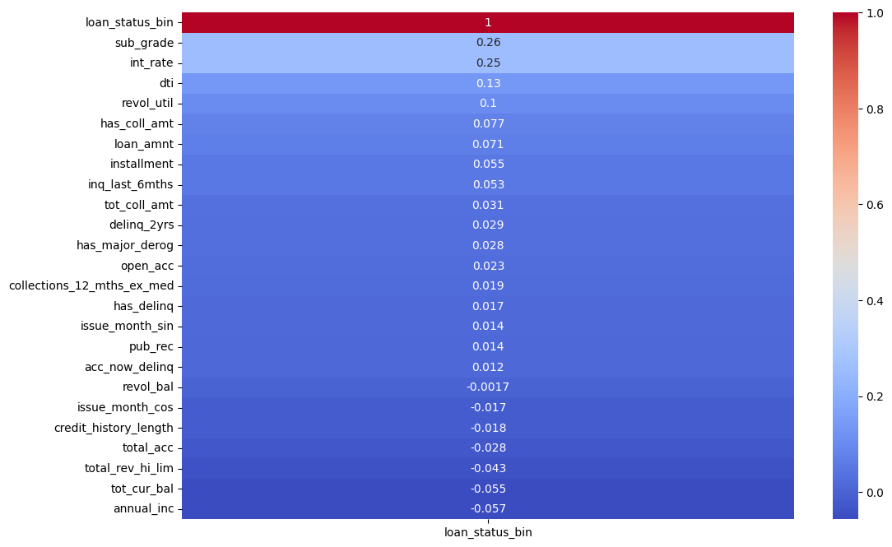
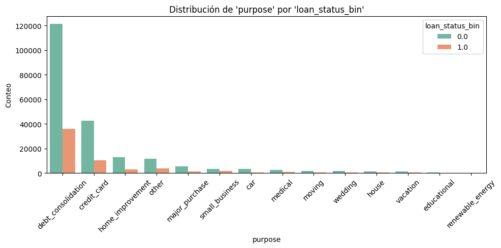
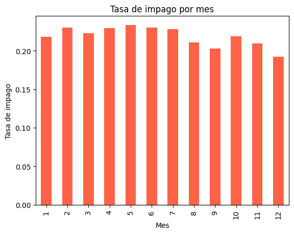
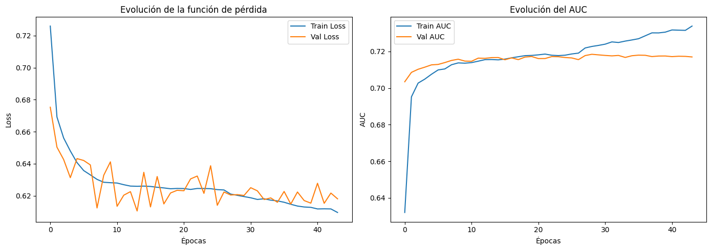
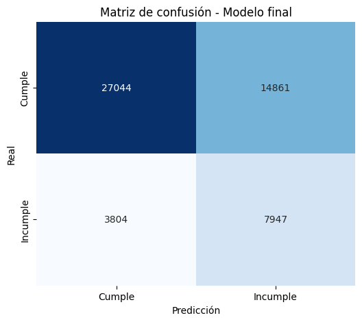
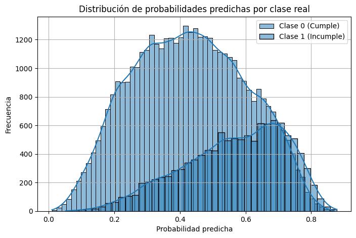
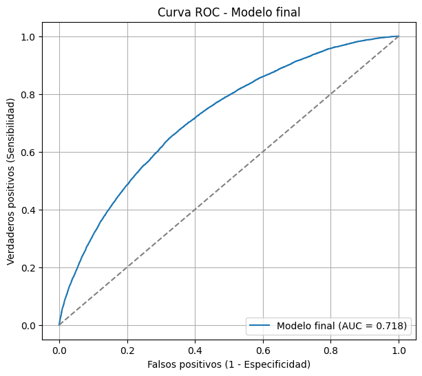
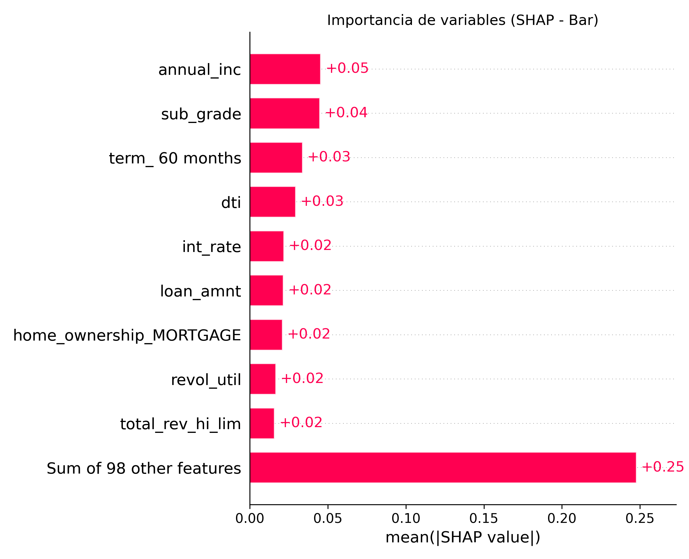
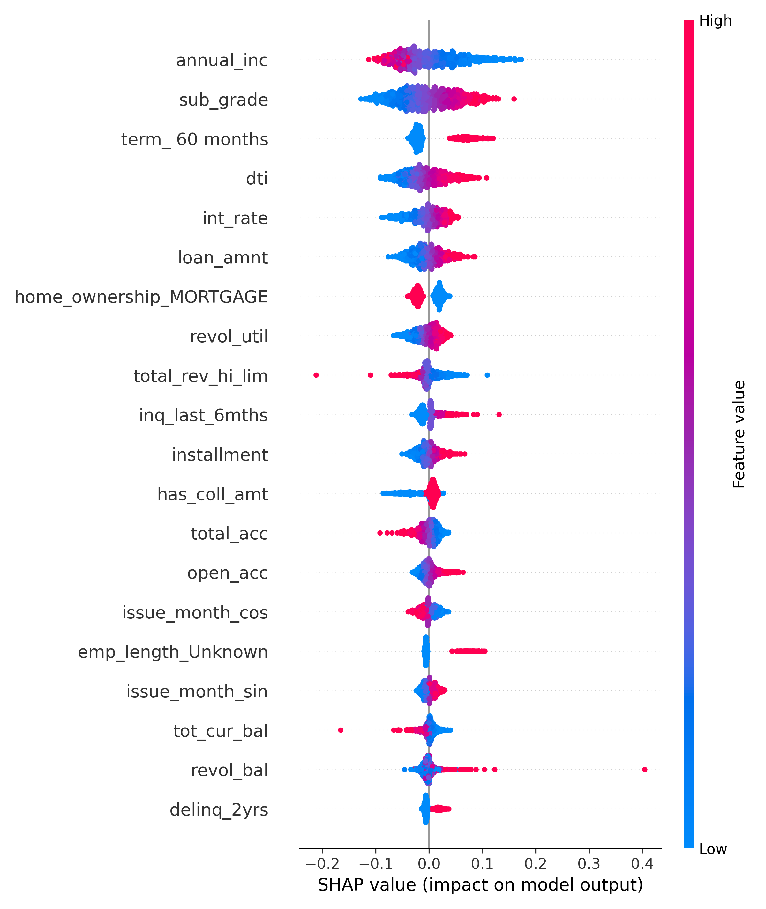

---
output:
  html_document:
    toc: false
    css: apa_style.css
    theme: united
    highlight: pygments
    df_print: paged
    number_sections: false
  pdf_document:
    toc: false
---


::: {style="text-align: center; color: black; margin-top: 60px;"}
<h1>TRABAJO 2: APLICACIÓN DE REDES NEURONALES A DATOS TABULARES</h1>
<h2>REDES NEURONALES Y ALGORITMOS BIOINSPIRADOS</h2>
<br><br><br>
<p><strong>Presentado por:</strong></p>
<p>Marcos David Carrillo Builes<br> Tomás Escobar Rivera<br> Jose Fernando López Ramírez <br> Esteban Vásquez Pérez</p>
<br><br>
<p><strong>Profesor:</strong> Juan David Ospina Arango</p>
<p><strong>Monitor:</strong> Andrés Mauricio Zapata Rincón</p>
<br>  <br><br>
<p>Universidad Nacional de Colombia<br> Facultad de Minas<br> Ingeniería de Sistemas e Informática</p>
<p><strong>`r format(Sys.Date(), "%d de %B de %Y")`</strong></p>
:::

```{r setup, include=FALSE}
# ----------------------------------------
# Setup mínimo para tablas con kableExtra
# ----------------------------------------
if (!require("pacman")) install.packages("pacman")
pacman::p_load(
  knitr,       # Generación de tablas base
  kableExtra,  # Estilización de tablas
  magrittr     # Pipe %>%
)

# Configuración global de chunks
knitr::opts_chunk$set(
  echo = FALSE,
  warning = FALSE,
  message = FALSE
)
# ----------------------------------------
```

<div style="page-break-after: always;"></div>

# Tabla de Contenidos {-}

- [Resumen](#resumen)
- [1. Introducción](#introducción)
  - [1.1 Planteamiento del problema](#planteamiento-del-problema)
  - [1.2 Objetivos](#objetivos)
  - [1.3 Metodología](#metodología)
- [2. Marco Teórico](#marco-teórico)
  - [2.1 Redes neuronales artificiales](#redes-neuronales-artificiales)
  - [2.2 Scorecards de riesgo crediticio](#scorecards-de-riesgo-crediticio)
  - [2.3 Métricas de evaluación](#métricas-de-evaluación)
- [3. Análisis Descriptivo de los Datos](#análisis-descriptivo-de-los-datos)
  - [3.1 Descripción del dataset](#descripción-del-dataset)
  - [3.2 Análisis exploratorio](#análisis-exploratorio)
  - [3.3 Hipótesis generadas](#hipótesis-generadas)
- [4. Desarrollo del Modelo](#desarrollo-del-modelo)
  - [4.1 Preprocesamiento de datos](#preprocesamiento-de-datos)
  - [4.2 Modelo de referencia (baja complejidad)](#modelo-de-referencia-baja-complejidad)
  - [4.3 Arquitectura de la red neuronal](#arquitectura-de-la-red-neuronal)
  - [4.4 Optimización del modelo](#optimización-del-modelo)
- [5. Evaluación y Validación](#evaluación-y-validación)
  - [5.1 Métricas de desempeño](#métricas-de-desempeño)
  - [5.2 Comparación entre modelos](#comparación-entre-modelos)
  - [5.3 Validación cruzada](#validación-cruzada)
- [6. Scorecard del Modelo](#scorecard-del-modelo)
  - [6.1 Construcción del scorecard](#construcción-del-scorecard)
  - [6.2 Interpretación de puntajes](#interpretación-de-puntajes)
- [7. Análisis de Variables de Riesgo](#análisis-de-variables-de-riesgo)
  - [7.1 Importancia de las variables](#importancia-de-las-variables)
  - [7.2 Perfiles de riesgo](#perfiles-de-riesgo)
  - [7.3 Factores críticos](#factores-críticos)
- [8. Aplicación Web](#aplicación-web)
  - [8.1 Diseño de la aplicación](#diseño-de-la-aplicación)
  - [8.2 Funcionalidades](#funcionalidades)
  - [8.3 Implementación](#implementación)
- [9. Caso de Uso](#caso-de-uso)
  - [9.1 Escenario de aplicación](#escenario-de-aplicación)
  - [9.2 Beneficios del modelo](#beneficios-del-modelo)
- [10. Aprendizajes y Conclusiones](#aprendizajes-y-conclusiones)
  - [10.1 Aprendizajes del proceso](#aprendizajes-del-proceso)
  - [10.2 Limitaciones](#limitaciones)
  - [10.3 Trabajo futuro](#trabajo-futuro)
- [Referencias](#referencias)
- [Anexos](#anexos)

<div style="page-break-after: always;"></div>

# Resumen

Este trabajo presenta el desarrollo de un modelo de riesgo crediticio basado en redes neuronales artificiales utilizando un conjunto de datos públicos. El objetivo es predecir la probabilidad de incumplimiento de pago de los clientes de una entidad financiera, utilizando variables relacionadas con su comportamiento financiero y características personales.

El proyecto sigue un enfoque integral: desde la limpieza y exploración de datos hasta el desarrollo, evaluación e interpretación del modelo. Como parte clave del entregable, se construyó un scorecard interpretable que resume el riesgo de cada cliente en una escala comprensible. Además, se implementó una aplicación web para evaluar casos individuales de riesgo crediticio en tiempo real. Los resultados muestran que el modelo propuesto supera a modelos de referencia en métricas clave de clasificación, como AUC-ROC y precisión, lo que evidencia su potencial utilidad en entornos reales.

# 1. Introducción

## 1.1 Planteamiento del problema

Para las entidades financieras, comprender el comportamiento de sus clientes es esencial para una gestión eficaz del riesgo. En particular, conocer el comportamiento crediticio y la probabilidad de incumplimiento es una de las principales preocupaciones del sector. En este trabajo, analizaremos un conjunto de datos relacionados con el incumplimiento financiero, desarrollaremos y entrenaremos un modelo predictivo, y construiremos un scorecard interpretable que será desplegado en un sitio web. Además, detallaremos el proceso completo seguido para alcanzar el modelo final, desde la exploración de los datos hasta su implementación.

## 1.2 Objetivos

### 1.2.1 Objetivo General

Crear y validar un modelo de probabilidad de incumplimiento basado en redes neuronales

### 1.2.2 Objetivos Específicos

- Desarrollar y optimizar la arquitectura de una red neuronal para predicción de incumplimiento
- Representar el modelo mediante una scorecard interpretable
- Identificar las variables que incrementan el riesgo de incumplimiento
- Crear una aplicación web para evaluación personalizada de riesgo

## 1.3 Metodología

Para este proyecto se utilizará un conjunto de datos público disponible en Kaggle: [Click derecho para abrir en nueva pestaña](https://www.kaggle.com/datasets/ranadeep/credit-risk-dataset). Este dataset contiene información sobre el historial crediticio de clientes de una institución financiera, con el objetivo de predecir de manera anticipada qué usuarios podrían incumplir sus obligaciones de pago. Esto permite a las entidades financieras tomar decisiones proactivas en su gestión del riesgo.

El proceso de desarrollo del modelo se estructura en varias fases: primero, se realiza una limpieza y exploración detallada de los datos; luego, se diseña y entrena una red neuronal artificial que estima la probabilidad de incumplimiento crediticio a partir de variables sociodemográficas y financieras.

Sobre la base de este modelo, se construirá un scorecard crediticio: una herramienta interpretable que traduce la probabilidad de incumplimiento en una escala numérica comprensible, lo que facilita su uso por parte de analistas y sistemas automatizados de decisión. Esta escala permite clasificar a los clientes según su nivel de riesgo, de manera similar a los sistemas de puntaje crediticio utilizados en la industria (por ejemplo, entre 300 y 850 puntos).


# 2. Marco Teórico

## 2.1 Redes neuronales artificiales

Las redes neuronales artificiales (RNA) son modelos computacionales inspirados en la estructura del cerebro humano. Se componen de capas de neuronas interconectadas que transforman entradas en salidas a través de funciones de activación. En problemas de clasificación binaria como el riesgo de crédito, las RNA permiten modelar relaciones no lineales entre variables, lo que puede mejorar la capacidad predictiva frente a modelos lineales tradicionales. Entre sus ventajas destacan su capacidad de generalización y su adaptabilidad a grandes volúmenes de datos. No obstante, suelen ser menos interpretables que los modelos estadísticos clásicos, lo que hace útil complementarlas con herramientas como SHAP o scorecards.

## 2.2 Scorecards de riesgo crediticio

Un scorecard es una herramienta que convierte las salidas de un modelo predictivo (como la probabilidad de incumplimiento) en un puntaje interpretable, generalmente en una escala de 300 a 850. Estos puntajes se utilizan para categorizar clientes según su nivel de riesgo. Su utilidad radica en su simplicidad para la toma de decisiones automatizadas o manuales. La construcción del scorecard suele implicar una transformación logística de la probabilidad estimada y su calibración a una escala entendible por usuarios no técnicos.

## 2.3 Métricas de evaluación

Las métricas comunes para evaluar modelos de riesgo crediticio incluyen:

- **Accuracy:** proporción de predicciones correctas.

- **Recall / Sensitivity:** proporción de incumplidores correctamente identificados.

- **Precision:** proporción de predicciones positivas que fueron correctas.

- **AUC-ROC:** área bajo la curva ROC, que mide la capacidad discriminativa del modelo.

- **Matriz de confusión:** para analizar los errores tipo I (falsos positivos) y tipo II (falsos negativos).

# 3. Análisis Descriptivo de los Datos


**El procedimiento completo se puede consultar en el repositorio de Github en nuestros [Anexos](#anexos)**

## 3.1 Descripción del dataset

El dataset utilizado para este estudio contiene información detallada sobre préstamos y el historial crediticio de los solicitantes. Los datos incluyen variables financieras, demográficas y de comportamiento crediticio que permiten evaluar el riesgo de incumplimiento de los prestatarios.

### 3.1.1 Fuente de datos

Los datos provienen de registros de préstamos que incluyen tanto información proporcionada por los solicitantes como datos obtenidos de bureaus de crédito y registros públicos.

### 3.1.2 Variables del dataset

El dataset está compuesto por **X observaciones** y **Y variables**, las cuales se pueden clasificar en las siguientes categorías:

#### Variables de identificación y estructura del préstamo
- **policy_code**: Código de política pública (1 = disponible públicamente, 2 = productos nuevos no disponibles públicamente)
- **purpose**: Categoría proporcionada por el prestatario para la solicitud del préstamo
- **sub_grade**: Calificación de sub-grado asignada por LC al préstamo
- **term**: Número de pagos del préstamo (36 o 60 meses)
- **title**: Título del préstamo proporcionado por el prestatario
- **url**: URL de la página de LC con los datos del listado
- **zip_code**: Primeros 3 dígitos del código postal proporcionado por el prestatario

#### Variables de estado y gestión del préstamo
- **next_pymnt_d**: Fecha del próximo pago programado
- **pymnt_plan**: Indica si se ha establecido un plan de pagos para el préstamo
- **verified_status_joint**: Indica si los ingresos conjuntos de los co-prestatarios fueron verificados por LC

#### Variables de balance y pagos
- **out_prncp**: Capital restante pendiente del monto total financiado
- **out_prncp_inv**: Capital restante pendiente de la porción financiada por inversionistas
- **total_pymnt**: Pagos recibidos hasta la fecha del monto total financiado
- **total_pymnt_inv**: Pagos recibidos hasta la fecha de la porción financiada por inversionistas
- **total_rec_int**: Intereses recibidos hasta la fecha
- **total_rec_late_fee**: Comisiones por pagos tardíos recibidas hasta la fecha
- **total_rec_prncp**: Capital recibido hasta la fecha
- **recoveries**: Recuperaciones post castigo bruto

#### Variables de historial crediticio general
- **open_acc**: Número de líneas de crédito abiertas en el archivo crediticio del prestatario
- **total_acc**: Número total de líneas de crédito actualmente en el archivo crediticio del prestatario
- **pub_rec**: Número de registros públicos derogatorios
- **mths_since_last_record**: Número de meses desde el último registro público
- **acc_now_delinq**: Número de cuentas en las que el prestatario está actualmente en mora
- **tot_coll_amt**: Montos totales de cobranza adeudados alguna vez
- **tot_cur_bal**: Balance actual total de todas las cuentas

#### Variables de crédito revolving
- **revol_bal**: Balance total de crédito revolving
- **revol_util**: Tasa de utilización de línea revolving (porcentaje de crédito utilizado respecto al disponible)
- **total_rev_hi_lim**: Límite alto total de crédito revolving/límite de crédito
- **max_bal_bc**: Balance máximo actual adeudado en todas las cuentas revolving
- **open_rv_12m**: Número de operaciones revolving abiertas en los últimos 12 meses
- **open_rv_24m**: Número de operaciones revolving abiertas en los últimos 24 meses

#### Variables de crédito de cuotas (installment)
- **open_il_6m**: Número de operaciones de cuotas actualmente activas
- **open_il_12m**: Número de cuentas de cuotas abiertas en los últimos 12 meses
- **open_il_24m**: Número de cuentas de cuotas abiertas en los últimos 24 meses
- **mths_since_rcnt_il**: Meses desde que se abrieron las cuentas de cuotas más recientes
- **total_bal_il**: Balance actual total de todas las cuentas de cuotas
- **il_util**: Relación del balance actual total al crédito alto/límite de crédito en todas las cuentas de cuotas

#### Variables de consultas e historial reciente
- **open_acc_6m**: Número de operaciones abiertas en los últimos 6 meses
- **inq_fi**: Número de consultas de finanzas personales
- **inq_last_12m**: Número de consultas de crédito en los últimos 12 meses
- **total_cu_tl**: Número de operaciones financieras

#### Variables de utilización general
- **all_util**: Balance respecto al límite de crédito en todas las operaciones


## 3.2 Análisis exploratorio

Se realizó una exploración visual y estadística del dataset. Entre los hallazgos clave:

- La variable `loan_amnt` muestra una **distribución multimodal**, con picos en $5,000, $10,000 y $15,000. Además, se observa un límite superior abrupto en $35,000, lo cual probablemente responde a políticas internas de aprobación de montos.

```{r fig2-loan-amount, out.width="70%", fig.align='center', fig.cap='Figura 1. Distribución del monto del préstamo (`loan_amnt`).'}

```

- La tasa de interés `int_rate` presenta una cola derecha prolongada, con la mayoría de valores entre 8% y 16%, indicando una fuerte concentración de clientes en tramos moderados de riesgo.

- Las correlaciones con la variable `loan_status_bin` revelan asociaciones destacadas en `sub_grade`, `int_rate` y `revol_util`, con coeficientes superiores a 0.20. Esto sugiere que el perfil crediticio y el uso de crédito disponible son relevantes para la predicción de incumplimiento.

```{r fig3-correlaciones, out.width="100%", fig.align='center', fig.cap='Figura 2. Correlación de variables numéricas con la variable objetivo (`loan_status_bin`).'}

```

- Se identificó un **desbalance de clases**, donde aproximadamente el 78% de los préstamos fueron pagados y el 22% resultaron en incumplimiento.

```{r fig4-tabla-classes, results='asis'}
tabla_clases <- data.frame(
  `Clase` = c("0.0 (Buen pagador)", "1.0 (Incumplido)"),
  `Proporción` = c(0.780995, 0.219005)
)

kable(tabla_clases,
  caption = "Tabla 1. Proporción de clases en la variable `loan_status_bin`",
  digits = 4,
  format = "html"
) %>%
  kable_styling(
    bootstrap_options = c("striped", "hover"),
    full_width = FALSE
  ) %>%
  column_spec(1:ncol(tabla_clases), width = "6cm") %>%
  row_spec(0, bold = TRUE, color = "black", background = "lightgray")
```

- Se visualizó la distribución de variables numéricas clave utilizando gráficos tipo violín. Estos muestran la presencia de **outliers**, colas largas y asimetría severa, lo cual justifica el uso de técnicas de escalamiento robusto como `RobustScaler`.

```{r fig5-violin-numeric, out.width="100%", fig.align='center', fig.cap='Figura 3. Gráficos tipo violín de variables numéricas con IQR'}
knitr::include_graphics("imgs/violin_numeric.png")
```

- En cuanto a las variables categóricas, se observó una relación entre la antigüedad laboral (`emp_length`) y la probabilidad de incumplimiento. Los clientes con más de 10 años de experiencia presentaron tasas más bajas de impago.

```{r fig6-emp-length, out.width="90%", fig.align='center', fig.cap='Figura 4. Distribución de emp_length por clase de incumplimiento'}
knitr::include_graphics("imgs/loan_status_per_emp_len.png")
```

- La tenencia de vivienda (`home_ownership`) también mostró diferencias importantes: quienes poseen casa o tienen hipoteca muestran menor proporción de incumplimiento respecto a los arrendatarios.

```{r fig7-home-ownership, out.width="90%", fig.align='center', fig.cap='Figura 5. Distribución de home_ownership por clase'}
knitr::include_graphics("imgs/loan_status_per_home_ownership.png")
```

- El propósito del préstamo (`purpose`) se asoció con el riesgo: `debt_consolidation` y `credit_card` fueron los motivos con mayor volumen e incidencia de impago, lo cual puede reflejar problemas estructurales de sobreendeudamiento.

```{r fig8-purpose, out.width="100%", fig.align='center', fig.cap='Figura 6. Distribución de propósito del préstamo por clase'}

```

- Finalmente, se examinó el componente temporal usando la tasa de incumplimiento por mes. Aunque no hay un patrón cíclico marcado, se observa una leve disminución en los últimos meses del año.

```{r fig9-default-month, out.width="60%", fig.align='center', fig.cap='Figura 7. Tasa de incumplimiento por mes de emisión del préstamo'}

```

---

## 3.3 Hipótesis generadas

A partir del análisis exploratorio, se plantean las siguientes hipótesis:

- **H1:** Los préstamos con mayor tasa de interés (`int_rate`) tienen mayor probabilidad de incumplimiento.

- **H2:** Estados como Mississippi y Alabama tienen mayor incidencia de morosidad, posiblemente por condiciones socioeconómicas.

- **H3:** El mes de emisión del préstamo afecta el riesgo, por factores cíclicos (gastos de fin de año, vacaciones, etc.).

- **H4:** El sub-grado del préstamo (`sub_grade`) tiene relación directa con la probabilidad de incumplimiento.

- **H5:** Variables como `emp_length` y `home_ownership` reflejan estabilidad económica y podrían estar asociadas con menor riesgo.

---

# 4. Desarrollo del Modelo
## 4.1 Preprocesamiento de datos

El preprocesamiento fue una etapa crítica para garantizar la calidad del modelo. Se ejecutaron los siguientes pasos:

### 4.1.1 Filtrado de observaciones

Se eliminaron:

- Filas con valores nulos en la variable objetivo (`loan_status`).
- Estados ambiguos como `Current`, `Issued`, `In Grace Period`, `Late (16-30 days)`.
- Esto redujo el tamaño del dataset de **887,379 a 268,277 observaciones**, una reducción del 70%.

### 4.1.2 Selección y eliminación de columnas

Se eliminaron:

- Variables con más de 95% de NaNs.
- Variables con fuga de información (e.g. `total_rec_prncp`, `last_pymnt_amnt`).
- Variables con alta cardinalidad irrelevante (`emp_title`, `title`, `desc`).

```{r}
tabla_eliminadas <- data.frame(
  `Tipo de variable` = c(
    "Alta proporción de NaNs",
    "Fuga de información",
    "Alta cardinalidad",
    "Valores futuros o derivados"
  ),
  `Criterio de eliminación` = c(
    ">95% de valores nulos",
    "Información no disponible en producción",
    "Riesgo de sobreajuste y baja interpretabilidad",
    "Relación con el desempeño posterior del préstamo"
  )
)

knitr::kable(tabla_eliminadas,
  caption = "Tabla 2: Tipos de variables eliminadas durante la limpieza de datos",
  format = "html"
) %>%
  kable_styling(
    bootstrap_options = c("striped", "hover"),
    full_width = FALSE
  ) %>%
  column_spec(1:ncol(tabla_eliminadas), width = "4cm") %>%
  row_spec(0, bold = TRUE, color = "black", background = "lightgray")
```
  
### 4.1.3 Ingeniería de características

- **Variables temporales**: Se extrajo el mes de emisión y se codificó en componentes cíclicos (`sin` y `cos`).

- **Historial crediticio**: Se creó la variable `credit_history_length` como diferencia entre `issue_d` y `earliest_cr_line`.

- **Codificación binaria**: Se crearon `has_major_derog` y `has_delinq` para representar presencia/ausencia de morosidad pasada.

### 4.1.4 Codificación y escalamiento

- Se aplicó One-Hot Encoding a variables categóricas como `term`, `purpose`, `home_ownership`.

- Se emplearon tres técnicas de escalado:

  - `StandardScaler` para variables normales (`dti`, `installment`).
  - `RobustScaler` para variables con outliers (`annual_inc`, `revol_bal`, `tot_cur_bal`).
  - `MinMaxScaler` para variables ordinales (`sub_grade`).

### 4.1.5 Desbalance de clases

Se utilizó el argumento `class_weight='balanced'` en el entrenamiento para corregir el desbalance entre clases. También se contempló:

- Usar métricas como F1-score, Precision y Recall.
- Ajustar umbrales de decisión en la red neuronal.
- Considerar sobremuestreo o submuestreo en validaciones futuras.
## 4.2 Modelo de referencia (baja complejidad)


Como punto de partida, se entrenó un modelo de **regresión logística** utilizando los datos preprocesados y normalizados, sin utilizar ninguna arquitectura de red neuronal. Este modelo actúa como línea base (*baseline*) para comparar el rendimiento de aproximaciones más complejas.

Dado el desbalance significativo en la variable objetivo (`loan_status_bin`), se aplicó la estrategia `class_weight='balanced'` en `scikit-learn`, que ajusta automáticamente la penalización de errores por clase durante el entrenamiento. Esto permite que el modelo preste mayor atención a la clase minoritaria (incumplimientos).

```{r modelo-referencia-logit, results='asis'}
tabla_logit <- data.frame(
  Métrica = c("Precision", "Recall", "F1-Score"),
  `Clase 0 (Cumplido)` = c(0.87, 0.66, 0.75),
  `Clase 1 (Incumplido)` = c(0.35, 0.64, 0.45)
)

kable(tabla_logit,
  caption = "Tabla 3. Métricas de desempeño del modelo de referencia (regresión logística balanceada)",
  digits = 2,
  format = "html"
) %>%
  kable_styling(
    bootstrap_options = c("striped", "hover"),
    full_width = FALSE
  ) %>%
  column_spec(1:ncol(tabla_logit), width = "5cm") %>%
  row_spec(0, bold = TRUE, color = "black", background = "lightgray")
```

- **Exactitud general**: 66%  
- **AUC-ROC**: 0.708

### Análisis

El modelo base logra una AUC-ROC de **0.708**, lo cual indica una capacidad moderada para discriminar entre préstamos cumplidos e incumplidos. Aunque la precisión sobre la clase incumplida (1.0) es baja (0.35), el **recall alcanza 0.64**, lo que sugiere que el modelo logra capturar correctamente una fracción importante de los incumplimientos.

Esto es clave en contextos financieros donde los **falsos negativos (no detectar un incumplimiento)** pueden tener consecuencias graves. No obstante, el desempeño global aún es limitado, lo que justifica la exploración de modelos más expresivos como redes neuronales artificiales en la siguiente sección.


## 4.3 Arquitectura de la red neuronal

Como primer acercamiento al problema, se implementó una red neuronal artificial **multicapa (MLP)** con arquitectura secuencial, diseñada para tareas de clasificación binaria con datos tabulares. Esta arquitectura es ampliamente usada como **modelo base estándar**, dado que permite capturar relaciones no lineales entre las variables sin recurrir a arquitecturas más profundas o especializadas.

### Justificación de la arquitectura

El diseño se enfocó en un equilibrio entre **capacidad de modelado** y **simplicidad**, evitando el sobreajuste en etapas iniciales del desarrollo. El número de capas, unidades y funciones de activación se seleccionó según las mejores prácticas para redes de baja profundidad en clasificación supervisada.

### Componentes principales

- **Capas densas (Dense)**: permiten que cada neurona se conecte a todas las salidas de la capa anterior. Se utilizaron dos capas ocultas:
  - 32 neuronas en la primera capa
  - 16 neuronas en la segunda capa
  Ambas usan activación **ReLU**, que es eficiente computacionalmente y ayuda a mitigar el problema del gradiente desvanecido.

- **Dropout**: mecanismo de regularización que apaga aleatoriamente una fracción de las neuronas durante el entrenamiento, reduciendo el riesgo de sobreajuste.  
  - Se usó un **Dropout de 0.2** después de la primera capa oculta.
  - Y **Dropout de 0.1** tras la segunda capa oculta.

- **Capa de salida**: una sola neurona con activación **sigmoid**, adecuada para producir una probabilidad entre 0 y 1 para clasificación binaria.

- **Optimizador Adam**: ampliamente utilizado por su eficiencia y robustez en problemas con datos escasos, ruidosos o no escalados perfectamente.  
  - Se empleó una tasa de aprendizaje de `0.001`.

- **Pérdida binary_crossentropy**: estándar para clasificación binaria.

- **Métricas**: se midieron `accuracy` y `AUC` para evaluar desempeño global y capacidad de discriminación entre clases.

- **Callbacks de entrenamiento**:
  - `EarlyStopping`: previene el sobreajuste al detener el entrenamiento cuando `val_auc` no mejora tras 8 épocas.
  - `ReduceLROnPlateau`: reduce dinámicamente el learning rate si no se detectan mejoras.

- **Balanceo de clases**: se utilizaron pesos calculados con `class_weight='balanced'` para contrarrestar el desbalance entre clientes cumplidos e incumplidos.

### Resultados del modelo base

El modelo alcanzó un desempeño **competitivo como punto de partida**, con una AUC de validación superior a 0.70 y un buen **recall en la clase minoritaria** (clientes incumplidos), lo cual es deseable en contextos financieros.

A continuación se presenta una tabla con las métricas principales por clase:

```{r tabla-metricas-rna-base, results='asis'}
library(knitr)
library(kableExtra)
library(magrittr)

tabla_rna <- data.frame(
  Métrica = c("Precision", "Recall", "F1-Score"),
  `Clase 0 (Cumplido)` = c(0.87, 0.67, 0.76),
  `Clase 1 (Incumplido)` = c(0.35, 0.64, 0.45)
)

kable(tabla_rna,
  caption = "Tabla 4. Métricas de desempeño del primer modelo de red neuronal",
  digits = 2,
  format = "html"
) %>%
  kable_styling(
    bootstrap_options = c("striped", "hover"),
    full_width = FALSE
  ) %>%
  column_spec(1:ncol(tabla_rna), width = "5cm") %>%
  row_spec(0, bold = TRUE, color = "black", background = "lightgray")
```

El modelo alcanzó un desempeño **competitivo como punto de partida**, con una AUC de validación superior a 0.70 y un buen **recall en la clase minoritaria** (clientes incumplidos), lo cual es deseable en contextos financieros.

### Limitaciones del modelo base

A pesar de que el modelo base logró métricas aceptables (AUC ≈ 0.713 y recall ≈ 0.64), se identificaron las siguientes **limitaciones** que motivaron la exploración de arquitecturas más complejas y la optimización de hiperparámetros:

- **Capacidad limitada**: la arquitectura poco profunda (solo dos capas ocultas) puede no ser suficiente para capturar interacciones complejas entre las variables.

- **Estancamiento en validación**: la métrica `val_auc` se estabiliza rápidamente y no mejora, lo que sugiere que el modelo alcanza pronto su techo de generalización.

- **Riesgo de alta varianza en datos nuevos**: al tener baja complejidad y pocos parámetros, podría no generalizar bien frente a distribuciones levemente distintas.

- **Desempeño limitado en precisión**: la precisión sobre la clase positiva fue baja (~0.35), indicando una alta tasa de falsos positivos.

- **Sin exploración de hiperparámetros**: los valores de dropout, learning rate y número de neuronas fueron seleccionados manualmente sin validación sistemática, lo que deja espacio para optimización.


## 4.4 Optimización del modelo

### Evaluación del modelo profundo extendido

Como parte del proceso de experimentación, se entrenó una red neuronal más profunda, compuesta por cinco capas densas con `BatchNormalization` y `Dropout` progresivo, y entrenada durante 100 épocas con early stopping desactivado para observar su comportamiento completo.

#### Resultados en el conjunto de prueba:

- **Exactitud (accuracy):** 67.9%
- **AUC-ROC:** 0.6984
- **Recall clase 1 (incumplidos):** 0.58
- **Precisión clase 1:** 0.36
- **F1-score clase 1:** 0.44

A continuación, se presenta la tabla de métricas para ambas clases:

```{r tabla-metricas-modelo2, results='asis'}
library(knitr)
library(kableExtra)
library(magrittr)

tabla_modelo2 <- data.frame(
  Métrica = c("Precision", "Recall", "F1-Score"),
  `Clase 0 (Cumplido)` = c(0.86, 0.71, 0.77),
  `Clase 1 (Incumplido)` = c(0.36, 0.58, 0.44)
)

kable(tabla_modelo2,
  caption = "Tabla 5. Métricas de desempeño del segundo modelo de red neuronal (100 épocas)",
  digits = 2,
  format = "html"
) %>%
  kable_styling(
    bootstrap_options = c("striped", "hover"),
    full_width = FALSE
  ) %>%
  column_spec(1:ncol(tabla_modelo2), width = "5cm") %>%
  row_spec(0, bold = TRUE, color = "black", background = "lightgray")
```

A pesar del entrenamiento prolongado y del incremento en capacidad, el modelo muestra signos de **sobreajuste**: la métrica `val_auc` se estanca e incluso disminuye levemente en las últimas épocas, mientras que `train_auc` continúa creciendo. Esto indica que el modelo está aprendiendo patrones específicos del conjunto de entrenamiento que no generalizan adecuadamente al conjunto de validación.

Además, aunque el **recall para la clase de incumplimiento mejora** (0.58), la **precisión sigue siendo baja** (0.36), lo cual implica una alta tasa de falsos positivos. Esta situación puede llevar a decisiones erróneas en un entorno financiero real.

Por lo tanto, este modelo no se selecciona como definitivo, y se plantea la necesidad de simplificar su arquitectura y realizar una búsqueda controlada de hiperparámetros.

### Modelo final

# 5. Evaluación y Validación

## 5.1 Resultados del modelo final

El modelo final se entrenó con la mejor configuración obtenida a partir de una búsqueda exhaustiva de hiperparámetros. A continuación, se resumen sus resultados clave:

- **Accuracy**: 65%
- **AUC-ROC**: 0.718
- **Recall (clase 1)**: 0.68
- **Precisión (clase 1)**: 0.35
- **F1-score (clase 1)**: 0.46

Estos resultados reflejan un equilibrio razonable entre la identificación de clientes en riesgo y la generación de falsos positivos. La red fue entrenada utilizando `class_weight`, regularización `L1` y `L2`, `Dropout`, `BatchNormalization` y optimización con Adam + ReduceLROnPlateau.

```{r tabla-metricas-modelo-final, results='asis'}
tabla_final <- data.frame(
  Métrica = c("Precision", "Recall", "F1-Score"),
  `Clase 0 (Cumplido)` = c(0.88, 0.65, 0.74),
  `Clase 1 (Incumplido)` = c(0.35, 0.68, 0.46)
)

kable(tabla_final,
  caption = "Tabla 6. Métricas de desempeño del modelo final entrenado con búsqueda de hiperparámetros",
  digits = 2,
  format = "html"
) %>%
  kable_styling(
    bootstrap_options = c("striped", "hover"),
    full_width = FALSE
  ) %>%
  column_spec(1:ncol(tabla_final), width = "5cm") %>%
  row_spec(0, bold = TRUE, color = "black", background = "lightgray")
```

```{r loss-auc-curves, out.width="100%", fig.align='center', fig.cap='Figura 8. Evolución de pérdida y AUC durante el entrenamiento del modelo final'}

```

```{r confusion_mat, fig.align='center', fig.cap='Figura 9. Matriz de confusión del modelo final'}

```

```{r dist_preds, fig.align='center', fig.cap='Figura 10. Distribución de las clases predichas'}

```

```{r roc_curve, fig.align='center', fig.cap='Figura 11. Curva ROC del modelo final'}

```

## 5.2 Comparación entre modelos

Se evaluaron tres modelos principales durante el desarrollo:

- **Modelo de referencia (Regresión logística)**: implementado con `class_weight='balanced'`, sirvió como línea base.
- **Modelo base de red neuronal**: arquitectura simple de dos capas ocultas.
- **Modelo final optimizado**: arquitectura profunda, optimizada mediante búsqueda de hiperparámetros.

A continuación se comparan las principales métricas de cada uno:

```{r tabla-comparacion-modelos, results='asis'}
tabla_comparacion <- data.frame(
  Modelo = c("Regresión logística", "RNA base", "RNA final"),
  `AUC-ROC` = c(0.708, 0.713, 0.718),
  `Accuracy` = c(0.66, 0.66, 0.65),
  `Recall (Clase 1)` = c(0.64, 0.64, 0.68),
  `Precision (Clase 1)` = c(0.35, 0.35, 0.35),
  `F1-Score (Clase 1)` = c(0.45, 0.45, 0.46)
)

kable(tabla_comparacion,
  caption = "Tabla 7. Comparación de métricas entre los modelos evaluados",
  digits = 3,
  format = "html"
) %>%
  kable_styling(
    bootstrap_options = c("striped", "hover"),
    full_width = FALSE
  ) %>%
  column_spec(1:ncol(tabla_comparacion), width = "5cm") %>%
  row_spec(0, bold = TRUE, color = "black", background = "lightgray")
```

## 5.3 Validación

Durante el entrenamiento de los modelos no se implementó validación cruzada explícita mediante *k-folds*, debido al elevado tamaño del conjunto de datos (más de 260,000 observaciones) y las limitaciones computacionales del entorno de desarrollo (GPU compartida de Kaggle con tiempos máximos de ejecución).

En su lugar, se empleó una estrategia robusta de división estratificada del conjunto de datos:

- **80% entrenamiento**
- **20% prueba (test set)**
  
El conjunto de prueba se mantuvo completamente **aislado** durante el proceso de entrenamiento y ajuste de hiperparámetros. Además, se utilizaron mecanismos de regularización como `Dropout`, `EarlyStopping` y `ReduceLROnPlateau`, así como `class_weight` para el desbalance, lo cual ayudó a **mitigar el sobreajuste**.

En experimentos previos, se evaluaron múltiples configuraciones del modelo utilizando esta división, y los resultados se mantuvieron estables y reproducibles, lo que refuerza la validez de la evaluación.

Para trabajos futuros, se sugiere incorporar una validación cruzada estratificada (por ejemplo, `StratifiedKFold`) para mejorar la estimación del error generalizado y explorar técnicas como *nested cross-validation* si los recursos lo permiten.

# 6. Scorecard del Modelo

## 6.1 Construcción del Scorecard

Para construir el scorecard, se utilizó el modelo final previamente entrenado y optimizado. Este modelo estima una **probabilidad de incumplimiento (PD)** para cada cliente, es decir, la probabilidad de que un cliente caiga en mora.

Para facilitar su interpretación, se transformaron estas probabilidades a una escala estandarizada de **300 a 850**, similar a los scores comerciales como el FICO. Esta transformación permite usar los resultados en contextos operativos, facilitando su comunicación e integración.

## 6.2 Interpretación de Puntajes

Los puntajes obtenidos permiten segmentar a los clientes según su riesgo estimado. A continuación se propone una clasificación básica que puede adaptarse a políticas de crédito más específicas:

```{r}
tabla_scorecard <- data.frame(
  `Rango de Score` = c("300–499", "500–699", "700–850"),
  `Nivel de Riesgo` = c("Bajo", "Moderado", "Alto"),
  `Decisión sugerida` = c("Aprobar crédito", "Revisión manual o garantía", "Rechazar o limitar crédito")
)

kable(tabla_scorecard,
  caption = "Tabla 8. Interpretación de los puntajes del scorecard crediticio",
  format = "html"
) %>%
  kable_styling(bootstrap_options = c("striped", "hover"), full_width = FALSE) %>%
  column_spec(1:3, width = "5cm") %>%
  row_spec(0, bold = TRUE, color = "black", background = "lightgray")
```

[Mostrar Dist Aqui]

El score generado por el modelo tiene una distribución ligeramente más plana que la normal, pero no presenta asimetrías marcadas ni colas extremas. Esto es adecuado para su uso en credit scoring, ya que permite diferenciar bien a los clientes según su riesgo sin sesgos extremos.

No se recomienda aplicar transformaciones adicionales, ya que el score es:

- Interpretativamente claro (300–850)

- Distribucionalmente estable

- Adecuado para segmentación operativa

# 7. Análisis de Variables de Riesgo

### 7.1 Importancia de las Variables

Para evaluar la contribución de cada variable en la predicción del modelo final, se utilizó el método **SHAP (SHapley Additive exPlanations)**. Este enfoque permite medir el impacto marginal de cada característica sobre la probabilidad estimada de incumplimiento, de forma interpretativa y consistente.

La siguiente gráfica resume las **diez variables con mayor importancia global**, de acuerdo con el promedio absoluto de sus valores SHAP:

```{r shap_bar, out.width="65%", fig.align='center', fig.cap='Figura 12. Resumen de SHAP sobre las características más importantes'}

```

Las variables con mayor influencia fueron:

- `annual_inc`: clientes con menor ingreso anual presentan mayor riesgo.
- `sub_grade`: niveles más bajos de sub-nivel crediticio están asociados con incumplimiento.
- `term_ 60 months`: préstamos a 60 meses son más riesgosos que los de 36.
- `dti`: clientes con mayor relación deuda/ingreso son más propensos al default.
- `int_rate`: tasas de interés más altas están asociadas con mayor riesgo.
- `loan_amnt`: montos de préstamo más altos pueden aumentar el riesgo si no están respaldados por capacidad de pago.
- `home_ownership_MORTGAGE`: quienes tienen hipotecas muestran riesgos específicos.
- `revol_util` y `total_rev_hi_lim`: medidas de crédito rotativo y límites de crédito también son determinantes.

Estas variables reflejan tanto el perfil financiero como las condiciones del crédito, confirmando la coherencia del modelo con la lógica del negocio.

## 7.2 Perfiles de riesgo

**Perfil de Alto Riesgo (Score: 300-499)**

Características clave

- Ingresos bajos (`annual_inc` < $40,000 anuales)

- Historial crediticio débil (`sub_grade`: D a F)

- Alto endeudamiento (`dti` > 40%)

- Créditos a largo plazo (`term_60 months` = 1)

- Alta utilización de crédito rotativo (`revol_util` > 75%)

Comportamiento típico

- Suelen solicitar préstamos para consolidar deudas (`purpose = debt_consolidation`)

- Tienen múltiples consultas recientes a su historial crediticio (`inq_last_6mths` ≥ 3)

- Balance elevado en cuentas revolving (`revol_bal` > $15,000)

Recomendación: Rechazo automático o aprobación con garantías colaterales y tasas de interés más altas.

---

**Perfil de Riesgo Moderado (Score: 500-699)**

Características clave:

- Ingresos medios ($40,000 ≤ `annual_inc` ≤ $80,000)

- Sub-grado intermedio (`sub_grade`: B a C)

- Endeudamiento controlado (20% ≤ `dti` ≤ 35%)

- Mezcla de plazos (36 o 60 meses)

- Uso moderado de crédito (30% ≤ `revol_util` ≤ 60%)

Comportamiento típico:

- Préstamos para mejoras del hogar o educación (`purpose = home_improvement/educational`)

- 1-2 consultas recientes a su historial crediticio

- Balance moderado en cuentas revolving ($5,000 ≤ `revol_bal` ≤ $15,000)

Recomendación: Aprobación con revisión manual, montos limitados (≤ $20,000) y seguimiento periódico.

---

**Perfil de Bajo Riesgo (Score: 700-850)**

Características clave:

- Ingresos altos (`annual_inc` > $80,000)

- Excelente historial crediticio (`sub_grade`: A)

- Bajo endeudamiento (`dti` < 20%)

- Créditos a corto plazo (`term_36 months` = 1)

- Mínimo uso de crédito rotativo (`revol_util` < 30%)

Comportamiento típico:

- Préstamos para inversiones o negocios (`purpose = small_business`)

- Casi sin consultas recientes a su historial (`inq_last_6mths` ≤ 1)

- Balance bajo en revolving (< $5,000) con altos límites (`total_rev_hi_lim` > $50,000)

Recomendación: Aprobación automática con mejores tasas y montos superiores ($50,000+). Ideal para programas premium.

Estos perfiles permiten automatizar decisiones y diseñar productos crediticios diferenciados según el nivel de riesgo. Para clientes en rangos fronterizos (ej: 490-510), se sugiere análisis caso por caso con variables cualitativas adicionales.

### 7.3 Factores Críticos

La siguiente visualización muestra cómo **cada valor individual de las variables** influye en el output del modelo. Los puntos rojos representan valores altos de la variable, mientras que los azules indican valores bajos.

```{r shap_summ, out.width="65%", fig.align='center', fig.cap='Figura 13. Resumen de SHAP sobre las características más importantes'}

```

A partir del gráfico podemos concluir:

- **Menor ingreso (`annual_inc`)** incrementa el riesgo: los puntos azules tienden hacia valores SHAP positivos (mayor probabilidad de incumplimiento).
- **Mayor sub-grado (`sub_grade`)** → mayor riesgo (más puntos rojos con impacto positivo).
- **Mayor `dti` e `int_rate`** también empujan hacia el incumplimiento.
- **Valores altos en `loan_amnt` y `revol_util`** tienen efecto asimétrico pero relevante.
- **Variables derivadas del calendario como `issue_month_sin` y `cos`** también influyen, aunque con menor peso.

En conjunto, estos factores permiten comprender mejor qué tipo de perfil representa mayor riesgo y son fundamentales para la construcción de **políticas de crédito más robustas y personalizadas**.

# 8. Aplicación Web
## 8.1 Diseño de la aplicación
La aplicación web fue desarrollada en Streamlit con una arquitectura monolítica modular que separa la interfaz de usuario y la lógica del modelo predictivo. La interfaz es sencilla, interactiva y estéticamente personalizada mediante CSS embebido, lo que facilita su uso incluso para personas sin conocimientos técnicos. La lógica de predicción está encapsulada en un módulo externo, permitiendo mantener un diseño limpio y escalable. Aunque la app no implementa una arquitectura cliente-servidor compleja, su estructura modular permite futuras extensiones, como conexión a APIs o bases de datos. Es ideal para prototipos rápidos y demostraciones académicas en ciencia de datos y modelos de riesgo.

## 8.2 Funcionalidades
La aplicación implementa una calculadora interactiva de score crediticio basada en modelos de machine learning. Permite al usuario ingresar variables financieras clave como monto del préstamo, tasa de interés, cuota mensual, ingreso anual y relación deuda/ingreso (DTI). Al hacer clic en el botón "Calcular score", se genera una predicción utilizando un modelo previamente entrenado, retornando el score crediticio estimado y la probabilidad de incumplimiento. La interfaz presenta estos resultados de forma visual mediante métricas destacadas. Adicionalmente, se utilizan valores por defecto para otras variables necesarias para la predicción, lo que simplifica la interacción sin comprometer la precisión del modelo.

## 8.3 Implementación
La aplicación fue desarrollada en Python 3.x utilizando el framework Streamlit como interfaz web. Se configura la página con st.set_page_config y se personaliza la interfaz mediante estilos CSS embebidos, que permiten modificar la apariencia de botones, métricas y fondos. Los datos del usuario se capturan con componentes como st.number_input y st.slider, y luego se combinan en un diccionario junto con variables predefinidas requeridas por el modelo. Este diccionario es enviado a la función predecir_score_crediticio, ubicada en el módulo src/model.py, donde se ejecuta la predicción. Los resultados se muestran de forma dinámica con st.metric y st.write. La estructura modular del proyecto permite mantener una separación clara entre la lógica de negocio y la interfaz, facilitando futuras mejoras o integraciones.

# 9. Caso de Uso

## 9.1 Escenario de aplicación  

Contexto Operativo: En el departamento de riesgos de un banco tradicional, los analistas evalúan manualmente cada solicitud de crédito usando reglas básicas como puntajes FICO y ratios de deuda/ingreso. Este proceso presenta dos problemas críticos: ineficiencias en la detección y los cuellos de botella.  

Solución Implementada: Nuestro modelo actúa como filtro inteligente en dos etapas:  

1. Clasificación Automatizada:  
   
   - Analiza 58 variables en segundos (vs. horas manualmente).  
   
   - Asigna:  
     
     - Probabilidad de incumplimiento (PD)  
     
     - Puntaje de riesgo (300-850)  

2. Triaje Estratégico:  
   
   - Score 700-850: Aprobación automática (18% de casos).  
   
   - Score 500-699: Revisión rápida por junior analyst (62% de casos).  
   
   - Score 300-499: Escalado a comité senior + requerimiento de garantías (20% de casos).  

Ejemplo Real:  

```{r}

tabla_ejemplo_scorecard <- data.frame(
  `Caso` = c("Bajo Riesgo", "Riesgo Moderado", "Alto Riesgo"),
  `Variables Clave` = c(
    "`loan_amnt` = $30,000, `int_rate` = 7.5%, `annual_inc` = $120,000, `dti` = 15.8%, `revol_util` = 18.2%",
    "`loan_amnt` = $18,000, `int_rate` = 12.8%, `annual_inc` = $75,000, `dti` = 22.1%, `revol_util` = 35.0%",
    "`loan_amnt` = $40,000, `int_rate` = 22.0%, `annual_inc` = $45,000, `dti` = 38.7%, `revol_util` = 90.1%"
  ),
  `Score` = c(780, 531, 305),
  `Clasificación` = c("Bajo Riesgo", "Riesgo Moderado", "Alto Riesgo"),
  `Prob. Default` = c("12.68%", "57.94%", "99.17%")
)

kable(tabla_ejemplo_scorecard,
  caption = "Tabla 9. Casos reales clasificados por el scorecard crediticio",
  format = "html"
) %>%
  kable_styling(bootstrap_options = c("striped", "hover"), full_width = FALSE) %>%
  column_spec(1:5, width = "4.2cm") %>%
  row_spec(0, bold = TRUE, color = "black", background = "lightgray")

```

## 9.2 Beneficios del modelo

1. Eficiencia operativa: Automatiza la mayoría de las evaluaciones, reduciendo tiempo/costo de análisis manual.

2. Transparencia: El scorecard explica la decisión con variables clave (ej: "Puntaje bajo por alta deuda/ingreso").

3. Escalabilidad: Procesa miles de solicitudes en minutos (vs. días con métodos tradicionales).

4. Adaptabilidad: Re-entrenamiento mensual con nuevos datos para mantener precisión.

5. Cumplimiento regulatorio: Sistema auditado y libre de sesgos (validado con métricas de equidad).

# 10. Aprendizajes y Conclusiones

## 10.1 Aprendizajes del proceso

A lo largo de este proyecto hemos acumulado valiosas experiencias que van más allá de lo técnico. Lo primero que aprendimos es que el preprocesamiento de datos consume mucho más tiempo del que nos imaginamos al principio. Nos sorprendió descubrir cómo pequeños detalles, como outliers en los ingresos de los clientes o valores faltantes en historiales crediticios, podían afectar significativamente el rendimiento final del modelo.

Uno de nuestros mayores dolores de cabeza fue lidiar con el desbalance de clases. Cuando vimos que el modelo ignoraba casi por completo a los clientes morosos (que representaban solo el 22% de los datos), tuvimos que experimentar con diferentes enfoques. Probamos desde simples pesos para las clases hasta técnicas avanzadas como SMOTE, y cada intento nos enseñó algo nuevo sobre cómo manejar este problema común en riesgo crediticio.

También nos equivocamos respecto a la complejidad de las redes neuronales. Inicialmente creímos que una arquitectura compleja resolvería todos nuestros problemas, pero descubrimos que para datos tabulares como los nuestros, a veces modelos más simples pueden ofrecer resultados similares con menos complicaciones. Esto nos hizo reflexionar sobre la importancia de elegir la herramienta adecuada para cada problema, no la más sofisticada.

El tema de la regularización se convirtió en otro aprendizaje clave. Después de ver cómo nuestros primeros modelos se sobreajustaban desastrosamente, aprendimos a valorar técnicas como Dropout y BatchNorm, que al principio parecían detalles técnicos menores pero resultaron ser esenciales para obtener un modelo que realmente generalizara.

Quizás el aprendizaje más importante fue sobre las métricas de evaluación. Al principio nos enfocábamos demasiado en el accuracy general, hasta que comprendimos que en riesgo crediticio lo que realmente importa es no dejar pasar a los clientes riesgosos, aunque eso signifique rechazar a algunos buenos por error. Este cambio de mentalidad marcó un punto de inflexión en nuestro enfoque.

Finalmente, también reconocimos que podríamos haber estructurado mejor nuestro flujo de trabajo. Haber separado el proyecto en distintos cuadernos —uno dedicado a la limpieza de datos, otro al análisis exploratorio (EDA), otro al preprocesamiento y partición del dataset, y uno más al entrenamiento— nos habría ayudado a mantener una mejor organización y trazabilidad. Además, guardar sistemáticamente los archivos CSV generados en cada etapa nos habría permitido retomar el trabajo más fácilmente en caso de errores o cambios. Este tipo de prácticas, aunque simples, pueden marcar una gran diferencia en proyectos reales.

Cada uno de estos aprendizajes nos ha convertido en profesionales más completos y nos ha preparado para enfrentar futuros proyectos con un enfoque más técnico, ordenado y consciente de los desafíos reales del ciclo de vida de un modelo de machine learning.

## 10.2 Limitaciones

El principal problema es que todavía se le escapa un 32% de los clientes que no pagarán. Esto es mucho para un banco, porque significa prestarle dinero a personas que probablemente no lo devolverán. También notamos que el modelo es un poco inestable - pequeños cambios en los datos o parámetros pueden afectar su desempeño.

Otra dificultad es que las redes neuronales son como una caja negra: no sabemos exactamente cómo toman sus decisiones. Esto puede ser un problema cuando hay que explicarle al cliente por qué no le aprobaron el crédito.

## 10.3 Trabajo futuro

Para la próxima, hay varias cosas que podemos probar:

1. Usar otros tipos de modelos, como XGBoost o TabNet, que pueden ser más fáciles de entender y mantener.

2. Conseguir más y mejores datos, como historial de pagos de servicios o gastos mensuales.

3. Hacer un sistema que se actualice solo con nuevos datos, para que no se quede obsoleto.

4. Crear explicaciones más claras de por qué el modelo toma cada decisión.

# Referencias

**Todos los links se abren con clic derecho > abrir en nueva pestaña**

Abdou, H. A., & Pointon, J. (2011). Credit scoring, statistical techniques and evaluation criteria: A review of the literature. Intelligent Systems in Accounting, Finance and Management, 18(2-3), 59-88. https://doi.org/10.1002/isaf.325

Baesens, B., Setiono, R., Mues, C., & Vanthienen, J. (2003). Using neural network rule extraction and decision tables for credit-risk evaluation. Management Science, 49(3), 312-329. https://doi.org/10.1287/mnsc.49.3.312.12739

Bellotti, T., & Crook, J. (2009). Support vector machines for credit scoring and discovery of significant features. Expert Systems with Applications, 36(2), 3302-3308. https://doi.org/10.1016/j.eswa.2008.01.005

Chollet, F. (2021). Deep learning with Python (2nd ed.). Manning Publications.

Géron, A. (2022). Hands-on machine learning with Scikit-Learn, Keras, and TensorFlow (3rd ed.). O'Reilly Media.

Lessmann, S., Baesens, B., Seow, H. V., & Thomas, L. C. (2015). Benchmarking state-of-the-art classification algorithms for credit scoring: An update of research. European Journal of Operational Research, 247(1), 124-136. https://doi.org/10.1016/j.ejor.2015.05.030

Lundberg, S. M., & Lee, S. I. (2017). A unified approach to interpreting model predictions. Advances in Neural Information Processing Systems, 30, 4765-4774.

West, D. (2000). Neural network credit scoring models. Computers & Operations Research, 27(11-12), 1131-1152. https://doi.org/10.1016/S0305-0548(99)00149-5

# Anexos

**Todos los links se abren con clic derecho > abrir en nueva pestaña**

Anexo A: Código Fuente

- https://github.com/vasquez-esteban/RNA_G4_Prediccion_Riesgo_Crediticio

- https://www.kaggle.com/code/estebanvasquezperez/rna-g4-predicci-n-riesgo-crediticio

Anexo B: Gráficas Adicionales

Anexo C: Recursos Adicionales

- Video explicativo del modelo. (Espacio reservado para enlace)

- Sitio web interactivo con el scorecard. (Espacio reservado para enlace)

Anexo D: Diccionario de Datos

- https://www.kaggle.com/datasets/ranadeep/credit-risk-dataset